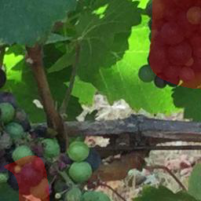
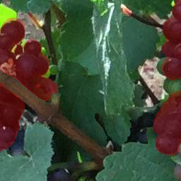
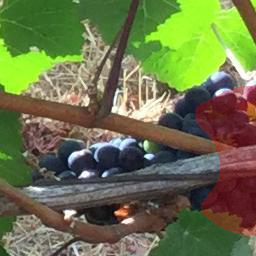

# Weakly-supervised-image-segmentation
A classification model is trained, then using a GRADCAM method is employed to extract masks used to train a segementation model. 
The [Pinot Noir Grapes dataset](https://www.kaggle.com/datasets/nicolaasregnier/pinotnoirgrapes) with a yolov8 format is preprocessed to be used as example.
## Usage
To preprocess the Pinot Noir Grapes dataset from the yolov8 format:

```
python ./tools/preprocessing.py --dataset_path --processed_dataset_path --img_size
```
with ```processed_dataset_path``` as the output processed dataset path.

To train the binary classifier model:

```
python ./classification_model/train.py --dataset_root_path
```
with ```dataset_root_path``` the processed dataset path.

To extract the masks from the classifier: ç

```
python ./mask_extractor/generate_mask.py --dataset_path --segmentation_dataset_path --model_weights
```
with ```segmentation_dataset_path``` the path to the output dataset with masks and ```model_weights``` the path to the classifier trained. 

To traing the segmentation model:

```
python ./segmentation_model/train.py --dataset_path --run_files
```
with ```dataset_path``` the path to the dataset with masks and ```run_files``` the path to save runs files.

## Results

Examples from the original images, the mask generated with the GRADCAM and the segmentation model is shown below.

      

      

      

      
